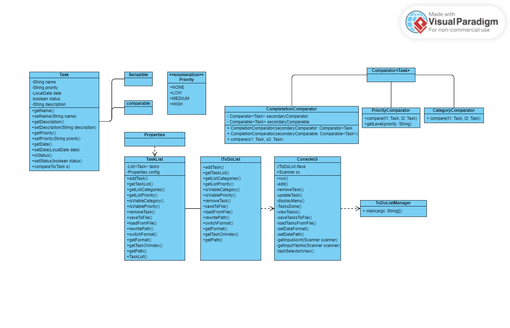

# ToDo List Manager

## Motivace

Od doby co jsem na vysoké škole jsem začal mít problémy pamatovat si veškeré úlohy a povinosti. 
Chtěl bych tedy vytvořit něco co bych mohl použít pro usnadnění této problematiky nejen mě, ale i ostatním.

## Popis problému

Chci vytvořit Konzolovou aplikaci, která uživatelům umožňuje vytvářet, prohlížet a spravovat seznam úkolů, které potřebují dokončit.
Uživatelé mohou označit úkoly jako dokončené, odstranit úkoly, zobrazit dokončené úkoly a nastavit čas pro dokončení úkolu. Každý úkol bude mít Název úkolu, Popis ulohy, termín dokončení úkolu, Úroveň priority úkolu a Stav úkolu (dokončeno nebo ne) tyto data se budou ukládat do souboru a následně se budou aktualizovat např. pokd uloha bude dokončena, upravena nebo smazána. V druhém souboru budou uložené kategorie (např. škola, prace ,nakupování)

## Řešení

### funkční specifikace

1. přidat úkol  
1. odebrat úkol
1. upravit úkol
1. označit úkol za dokončený
1. zobrazit všechny ulohy
1. uložit současný stav listu úkolů
1. nahrát uložený list úkolů
1. nastavení vlastní cesty k ukládání/nahrávání úkolů
1. změnit datový formát na txt/bin

### Popis struktury vstupních a výstupních souborů

**textové soubory:**
všechny informace v souborech jsou odděleny pomocí : '' ; ".
Informace jsou uloženy jako string a jsou pársovány pro použití v programu.
Údaje ukládané (v přesném pořadí) do souborů jsou :
* nazev ulohy
* kategorie
* popis ulohy
* priorita
* datum dokončení
* stav úkolu (dokončeno / nedokončeno)

**binární soubor**
ukládá list objektů task

### class diagram

### externí knihovna

**Apache Commons Lang:** https://commons.apache.org/proper/commons-lang/download_lang.cgi

Apache Commons Lang 3 je externí knihovna, poskytující různé funkce pro práci s jazykem Java. 
Knihovna nabízí mnoho nástrojů pro manipulaci s řetězci, čísly, datovými strukturami, práci s datem a časem, a mnoho dalšího.

**Použití**

1. Stáhněte si knihovnu Apache Commons Lang3: https://commons.apache.org/proper/commons-lang/download_lang.cgi
2. Přidejte JAR soubor knihovny do vašeho projektu.
